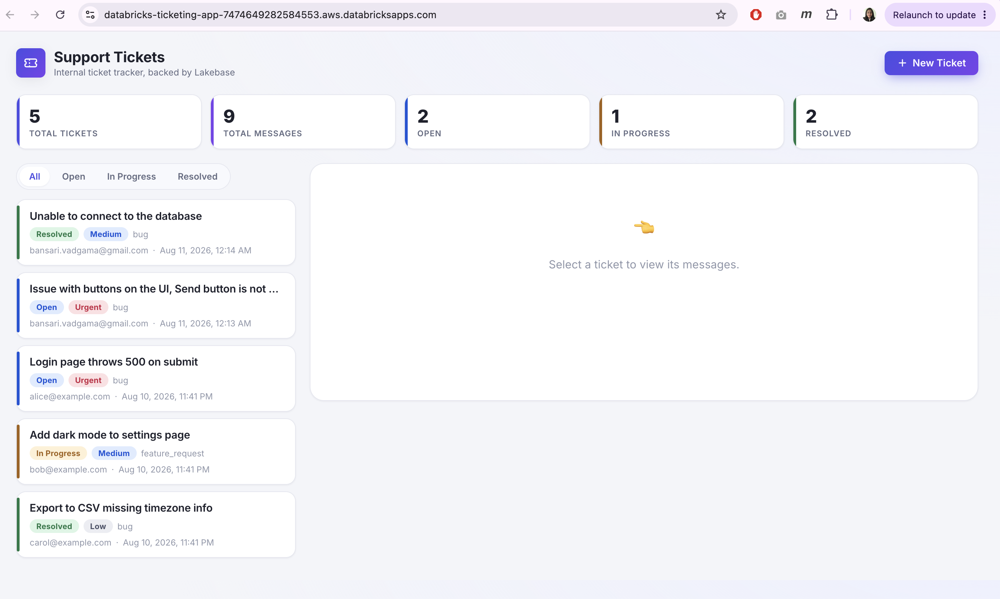
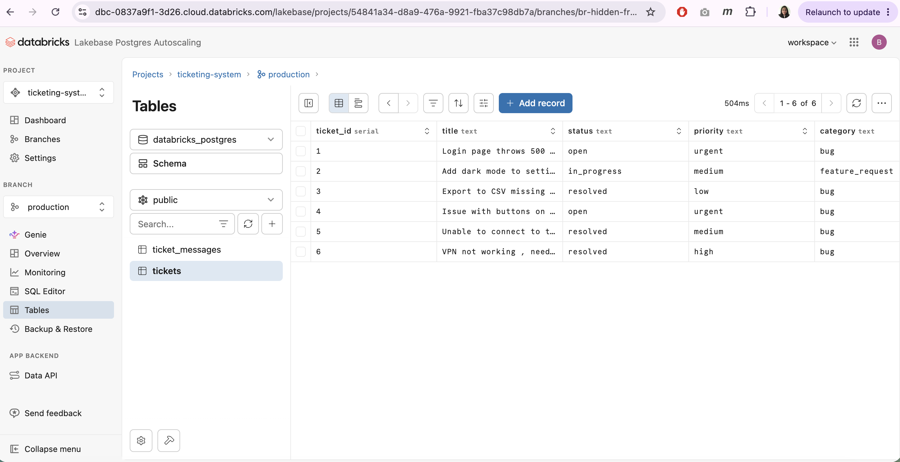
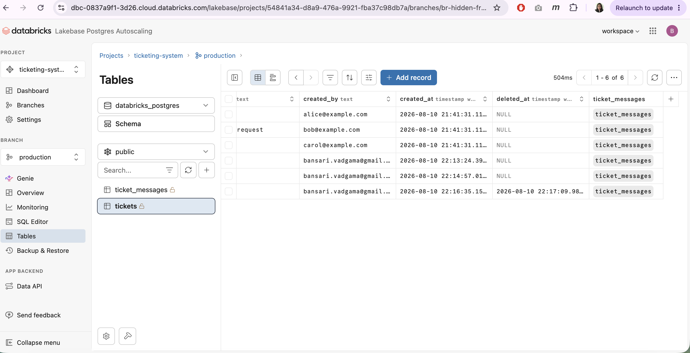
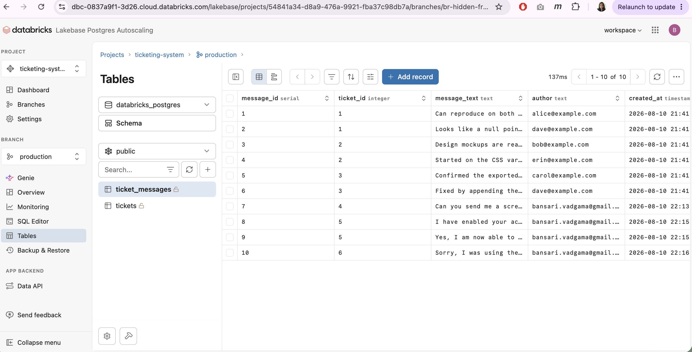
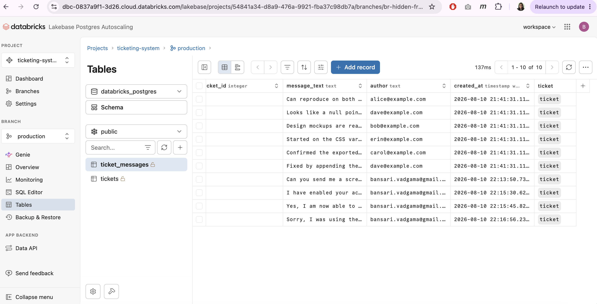

# Homework Submission — Lakebase-Powered Ticketing System

## 1. Databricks App URL

**https://databricks-ticketing-app-7474649282584553.aws.databricksapps.com**

## 2. Source code

Zipped from the project root (`ticketing-system/`) — see `ticketing-system-source.zip` alongside this file. Contains:
- `sql/` — versioned schema (`01`–`03`) and the ownership fix applied during setup (`04`)
- `src/` — the Flask app (`app.py`, `lakebase.py`, `setup_secrets.py`, `app.yaml`, `templates/`, `static/`)
- `scripts/` — one-off local admin script used to recreate the schema under the app's own role
- `README.md` — full setup/deploy walkthrough

## 3. Screenshot of the deployed application

Stats strip and filter pills reflect live Lakebase data: 5 active tickets, 9 active messages, split across Open/In Progress/Resolved.

## 4. Screenshots of the Lakebase tables and sample records

**`tickets` table** — `ticket_id`, `title`, `status`, `priority`, `category`:

**`tickets` table, scrolled to `created_by` / `created_at` / `deleted_at`** — row 6 shows a populated `deleted_at`, from testing the delete-with-confirmation bonus feature (soft delete keeps the row instead of removing it):

**`ticket_messages` table** — `message_id`, `ticket_id`, `message_text`, `author`, `created_at`:

**`ticket_messages` table, scrolled to show the `ticket` foreign-key reference** column confirming the `ticket_id → tickets.ticket_id` relationship:

Note: the tables show 6 tickets / 10 messages total, while the app's stats strip shows 5 tickets / 9 messages — the difference is ticket 6 (`VPN not working`) and its one message, which are soft-deleted (`deleted_at` set) and correctly excluded from the app's active counts while still present in the database.

## 5. Reflection

**What was the most difficult part?**
The Lakebase User which I had creted did not have permissions for the databricks app . Even though this user was created and had all the right grants, still I was not able to execute SQL Queries from Lakebase so I had to use the native origin user my account for these queries which created issue when deploying the app, so at the end I had manually run the script through command line from my repository to grant these permissions and get the app deployed and running.

**How is Lakebase different from storing this data in a traditional analytics table?**
Lakebase offers modern fetures such as support for CDC, DeltaTables supporting modern open table formats like Apache Iceberg which traditional analytics tables does not.

**What feature would you add next?**
I would have loved to implement the CDC next for getting hands-on only if I had a premium version of Databricks.
